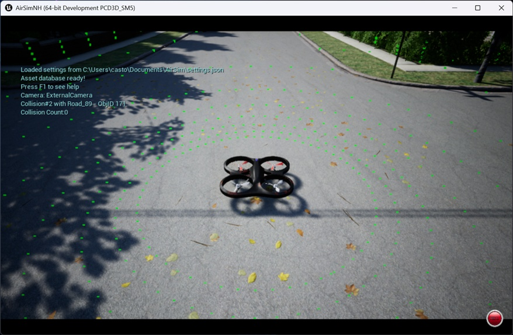
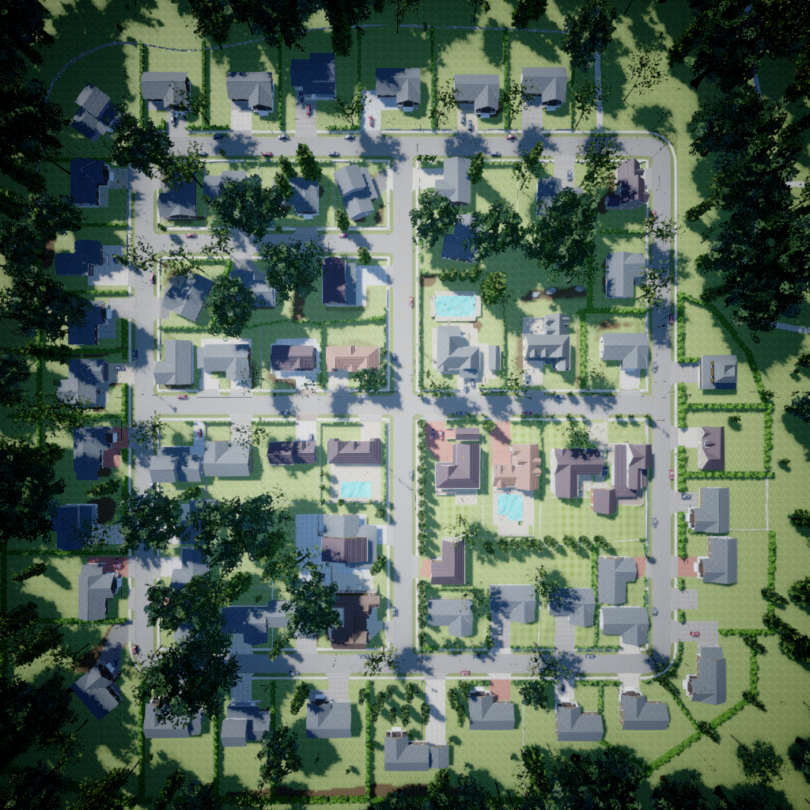
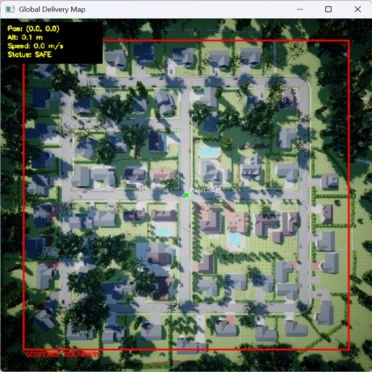
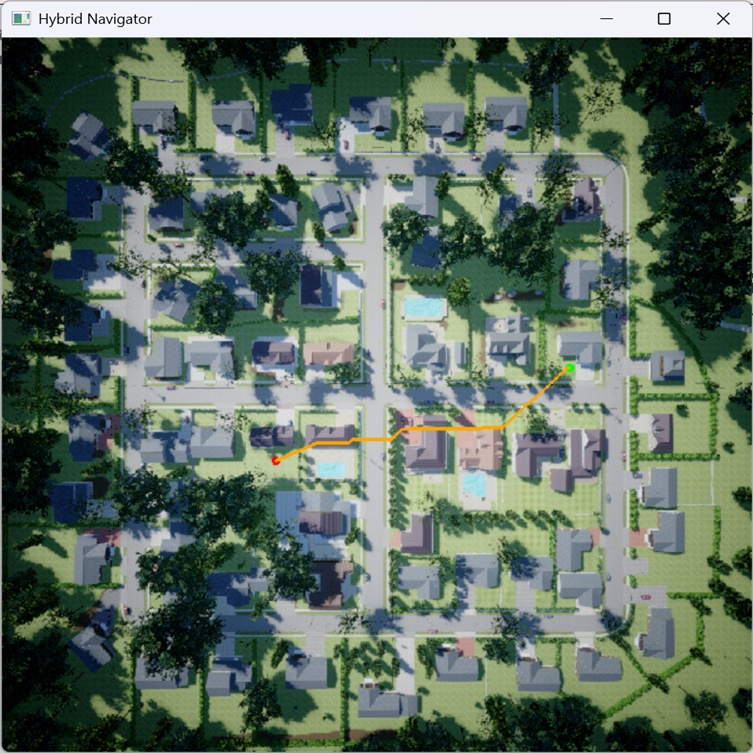

# CS530 Project Report: Auto Drone Simulation Navigation

**Team Members:** Yupu Guo, Jingdi Wu, Sooyoung Kim
**Github repo:** https://github.com/Colossus-MKII/cs530-project

## 1. Abstract

This report details the design and implementation of a hybrid autonomous navigation system for drone delivery within the Unreal Engine-based AirSimNH environment. To address the dual challenges of static route optimization and dynamic obstacle avoidance, we engineered a two-tier architecture: a macro-level **A\* global planner** and a micro-level **Artificial Potential Field (APF)** reactive controller. Furthermore, we introduced a heuristic-based state machine recovery mechanism to mathematically prevent deadlock scenarios commonly associated with standard APF implementations. Finally, we also add **reinforce learning** for the navigation and avoid the obstacle.

## 2. Environment Setup
AirSim is an open-source simulator for drones, cars and more, built on Unreal Engine. You can download its latest version (v1.8.1) from github: https://github.com/microsoft/airsim/releases
<figure align="center">
    
    <figcaption>Figure 1: AirSim Environment
</figure>
AirSim exposes APIs so we can interact with the drone in the simulation programmatically. You can use these APIs to retrieve images, get state, control the vehicle and so on. The APIs are exposed through the RPC, and are accessible via a variety of languages, including C++, Python, C# and Java.
We choose a town map AirSimNH as our experiment environment (Around 250m × 250m).

### 2.1 Fetch native 2D top-down map and grid map required for pathfinding.

The challenge is AirSim doesn't provide the native topography. So we flied the drone to 200m height to capture a high-resolution (1024 * 1024). Then we processed the image to create `astar_grid.npy` to discretizing obstacles for algorithm use.
<figure align="center">
    
    <figcaption>Figure 2: 2D top-down satellite map
</figure>

### 2.2 Create the global delivery map

Then we use `telemetry_map.py` to set up an application from former satellite map as following. In this application, user can fetch the position, altitude, speed information, the boundary of the map, and trace teh drone's flight path.
<figure align="center">
    
    <figcaption>Figure 3: Global Delivery Map
</figure>

### 2.3 Setup Interactive Interface

And we use the `autonomous_delivery.py` to set up a OpenCV-based GUI for user to choose the start and end.
The application will use A\* algorithm to plan a path and use Artificial Potential Field (APF) to avoid obstacles that isn't presented in 2D map.
The application also controls the drone's flight in *AirSimNH.exe*.
<figure align="center">
    
    <figcaption>Hybrid Navigator
</figure>


## 3. Algorithms

### 3.1 Global Planning with A\*

For macro-level navigation across the static grid, we implemented the A* search algorithm. This acts as the brain of the system, calculating the absolute shortest path before takeoff.

The algorithm minimizes the total cost function $f(n)$:
$$f(n) = g(n) + h(n)$$
- **Actual Cost $g(n)$:** Represents the accumulated physical flight distance from the starting node to the current node $n$. To accurately model energy expenditure, orthogonal movements are assigned a cost of $1$, while diagonal movements are assigned a cost of $\approx 1.414$ ($\sqrt{2}$).
- **Heuristic Cost $h(n)$:** We utilized the Euclidean distance as the heuristic to guide the search greedily toward the destination:$$h(n) = \sqrt{(x_n - x_{goal})^2 + (y_n - y_{goal})^2}$$

This ensures optimal energy consumption over long distances in static environments but lacks the reactivity needed for dynamic or unmapped obstacles.


### 3.2 Local Reactive Avoidance: Artificial Potential Field (APF)

To compensate for A*'s rigidity, we implemented an APF controller that acts as the drone's "Cerebellum," operating at a high-frequency control loop (10Hz) for instantaneous evasive maneuvers.

#### 3.2.1 Lidar-Driven Force Vectors
The drone's 360-degree Lidar point cloud is compressed into 8 horizontal sectors to reduce computational overhead. The flight velocity is dictated by the linear superposition of two virtual forces:
- **Attractive Force (Goal's Pull):** Generates a normalized velocity vector continuously pulling the drone toward the final destination.
- **Repulsive Force (Obstacle's Push):** If an obstacle is detected within the critical threshold ($10\text{m}$), a repulsive vector is generated. The magnitude of this force scales inversely with proximity:
$$\text{Magnitude} \propto (\text{Threshold} - \text{Current Distance})$$
- **Vector Addition:** The final commanded velocity is the sum of these vectors ($V_{target} = V_{att} + V_{rep}$), enabling smooth, reflex-like evasive maneuvers without stopping.

### 3.3 FSM & Anti-Deadlock Recovery Mechanism

The most significant flaw in standard APF is the "Local Minima" trap, where attractive and repulsive forces cancel out, causing the drone to deadlock or oscillate infinitely. To solve this, we designed a Finite State Machine (FSM) with a **Heuristic Recovery Mechanism**.

#### 3.3.1 The Hysteresis Threshold Logic
When the drone deviates from the A* path to avoid a threat, it records its current Euclidean distance to the goal (deviation_progress). After clearing the obstacle, the drone executes the following recovery protocol:

```python
elif fsm_state == STATE_AVOID:
            # APF Baseline
            dist_g = math.hypot(last_x - pos.x_val, last_y - pos.y_val)
            att_x, att_y = (last_x-pos.x_val)/dist_g*MAX_SPEED, (last_y-pos.y_val)/dist_g*MAX_SPEED
            rep_x, rep_y = 0.0, 0.0
            for i, d in enumerate(obs_sectors):
                if d < APF_TRIGGER_DIST:
                    ang = (i/8.0)*2*math.pi-math.pi
                    mag = (APF_TRIGGER_DIST - d) * 45.0
                    rep_x -= math.cos(ang)*mag
                    rep_y -= math.sin(ang)*mag
            vx, vy = att_x + rep_x, att_y + rep_y
```

After avoiding an obstacle, the drone scans the remaining A* route and snaps to a waypoint with a strictly smaller heuristic value (closer to the destination).
